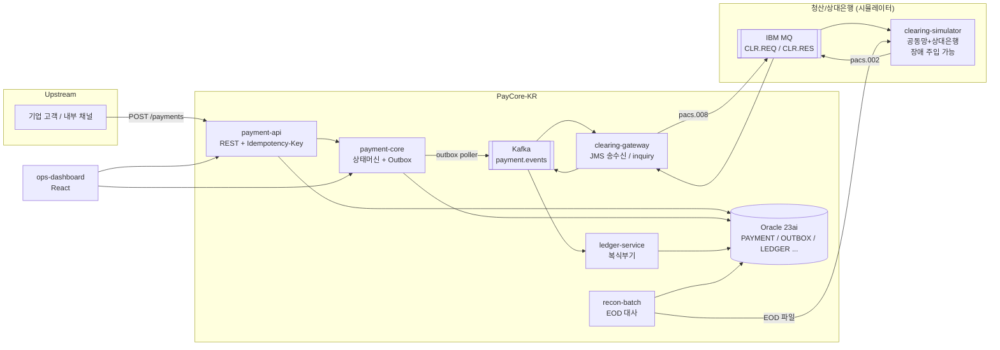
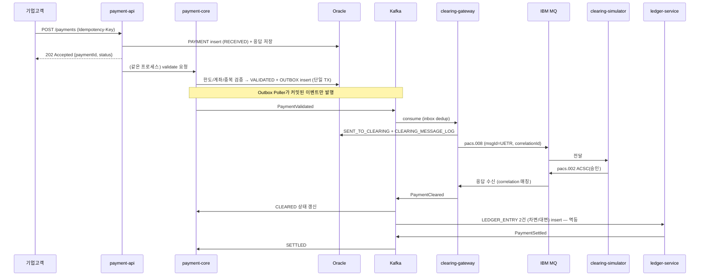
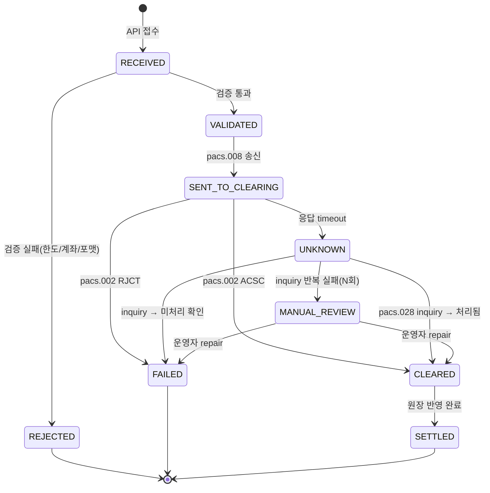

# PayCore-KR — 기업 결제(원화 이체) 처리 플랫폼 설계 및 Claude Code 구현 문서

> **Portfolio Project Design Document**
> 대상 포지션: 글로벌 은행 Payment Application Engineer (Java/Spring, Korea Payments)
> 이 문서는 사람이 읽는 설계 문서이자, **Claude Code가 단계별로 구현할 수 있는 실행 스펙**입니다.
> 문서 작성 기준일: 2026-08 / 버전 정보는 당시 안정(stable) 버전 기준이며, 구현 시점에 재확인할 것.

---

## 0. 한 문단 요약

기업 고객의 원화 이체 요청을 받아 **검증 → 청산망 전송 → 상태 추적 → 원장(settlement) 반영 → 대사(reconciliation)** 까지 처리하는 미니 결제 허브를 구현한다. 핵심은 화면이나 CRUD가 아니라 **비동기 메시징(MQ/Kafka) 기반의 트랜잭션 정합성**이다: 중복 지급 방지(idempotency), DB-메시지 일관성(transactional outbox), downstream timeout 시 불확실 상태 처리(status inquiry), 소비자 재처리 멱등성(inbox dedup), 일마감 3-way 대사, 그리고 장애 시나리오를 재현·복구하는 운영 도구까지 포함한다. 실제 청산망 대신 **금융결제원 전자금융공동망을 단순화한 시뮬레이터**를 직접 만들어 timeout / 중복응답 / 순서역전 같은 장애를 주입할 수 있게 한다.

---

## 1. 왜 이 프로젝트인가 — 채용 공고 요구사항 매핑

| 공고 키워드 | 이 프로젝트에서의 구현 |
|---|---|
| Secure, high-quality production code | 입력 검증, PII 마스킹 로깅, OWASP dependency check, 정적 분석, 코드리뷰 가능한 모듈 구조 |
| Upstream/downstream systems & technical implications | 채널 API → core → clearing gateway → 시뮬레이터(상대은행) → ledger → recon 전 구간을 직접 설계·구현 |
| Java 중심 개발 | Java 21 (LTS) + Spring Boot 4.x 멀티모듈 |
| DB | Oracle Database 23ai Free (Docker), 낙관적 락, 파티션 없는 단순 스키마지만 인덱스/제약 설계 명시 |
| 내부/외부 payment interface | 내부: Kafka 이벤트. 외부: IBM MQ 스타일 request/response 큐 + ISO 20022 축약 메시지(pacs.008/002/028) |
| MQ + Kafka 병행 | 외부 청산망 연동 = MQ(JMS), 내부 이벤트 전파 = Kafka — 실무와 같은 역할 분리 |
| 테스트/CI/CD, SDLC automation | Testcontainers 통합 테스트, Jenkinsfile 파이프라인, 장애 주입 테스트 자동화 |
| Technical troubleshooting / operational stability | UNKNOWN 상태 처리, DLQ + 운영 대시보드에서 repair, 장애 시나리오 7종 재현 스크립트 |
| 대규모 데이터 분석 | EOD 대사 배치(3-way match), break 분류/리포트 |
| React/HTML | 운영(Ops) 대시보드 — 결제 조회, 상태 타임라인, DLQ 재처리 버튼 (있으면 좋은 수준으로 유지) |

**면접 질문 → 설계로 직접 답변되는 매핑** (사용자가 예상한 질문 3개):

1. *"payment message를 보냈는데 downstream timeout이 발생했고 실제 상대 은행에는 처리되었다면 중복 지급을 어떻게 방지하는가?"* → §7.3 (UNKNOWN 상태 + E2E ID 기반 status inquiry + 청산망 측 중복 거절)
2. *"Kafka/MQ consumer 재처리 시 idempotency를 어떻게 보장하는가?"* → §7.2 (inbox/processed-message 테이블 + 유니크 제약 + 비즈니스 키 멱등성)
3. *"DB update와 외부 payment message 발송의 일관성을 어떻게 관리하는가?"* → §7.1 (transactional outbox, dual-write 금지)

---

## 2. 기술 스택 및 버전 (2026-08 기준 안정 버전)

| 구분 | 선택 | 버전/이미지 | 비고 |
|---|---|---|---|
| Language | Java | **21 (LTS)** | 금융권에서 가장 널리 채택된 LTS. 최신 LTS인 25로 올려도 무방(Boot 4.1은 17~26 지원) |
| Framework | Spring Boot | **4.1.x** (Spring Framework 7) | 3.5 라인은 2026-06-30 OSS EOL — 신규 프로젝트는 4.x |
| Build | Gradle (Kotlin DSL) | 최신 stable | 멀티모듈 |
| DB | Oracle Database Free (23ai) | Docker: `gvenzl/oracle-free` | Testcontainers `oracle-free` 모듈로 통합 테스트 |
| DB Migration | Flyway | Boot BOM 관리 버전 | 스키마를 코드로 관리 |
| Messaging (외부) | IBM MQ Developer Edition | Docker: `icr.io/ibm-messaging/mq` | 개발용 무료. 무겁다면 ActiveMQ Artemis(JMS)로 대체 가능 — 코드에서는 JMS 추상화 유지 |
| Messaging (내부) | Apache Kafka | **4.3.x** (KRaft, ZooKeeper 없음) | Docker: `apache/kafka`. 클라이언트는 spring-kafka(Boot BOM) |
| Frontend | React | **19** + Vite + TypeScript | 운영 대시보드 |
| CI/CD | Jenkins LTS (+ GitHub Actions 병행) | 최신 LTS | Jenkinsfile을 저장소에 포함 |
| Observability | Micrometer + Prometheus + Grafana, JSON 구조화 로깅 | Boot BOM | correlation id = endToEndId |
| Test | JUnit 5, AssertJ, Mockito, Testcontainers, Awaitility | Boot BOM | 장애 주입은 시뮬레이터 설정으로 |
| Container | Docker Compose | v2 | 로컬 전체 기동: `docker compose up` |

> **버전 원칙**: 위 표는 문서 작성 시점의 최신 안정 버전. Claude Code 구현 시작 시 `CLAUDE.md`의 지시에 따라 Spring Boot / Kafka / 이미지 태그의 최신 patch 버전을 확인 후 고정(pin)한다. 추측으로 버전을 적지 말 것.

---

## 3. 전체 아키텍처

### 3.1 컴포넌트 구성 (Gradle 멀티모듈 모노레포)

```
paycore-kr/
├── CLAUDE.md                     # Claude Code 작업 규칙 (§12.1)
├── docker-compose.yml            # oracle, kafka, ibm-mq, prometheus, grafana
├── Jenkinsfile
├── docs/                         # 이 문서 + ADR(Architecture Decision Records)
├── common/                       # 공유 DTO 없음 원칙. 메시지 스키마/에러코드/ID 생성기만
├── payment-api/                  # [서비스] 채널 API — 결제 접수 (upstream 대면)
├── payment-core/                 # [서비스] 오케스트레이션, 상태머신, outbox
├── clearing-gateway/             # [서비스] 청산망 연동 — MQ 송수신, timeout/inquiry
├── clearing-simulator/           # [도구] 금융결제원 공동망 + 상대은행 시뮬레이터 (장애 주입)
├── ledger-service/               # [서비스] 복식부기 원장 — Kafka consumer
├── recon-batch/                  # [배치] EOD 3-way 대사
└── ops-dashboard/                # [FE] React 운영 대시보드
```

### 3.2 시스템 구성도



역할 분리 원칙:
- **Kafka** = 내부 이벤트 버스. 상태 변화 사실(fact)을 전파. 파티션 키 = `paymentId` (per-payment 순서 보장).
- **MQ(JMS)** = 외부 청산망 인터페이스. request/response 큐, correlation id 기반 매칭 — 실제 은행-공동망 연동 방식과 동일한 형태.
- 서비스 간 동기 REST 호출은 upstream 대면(payment-api)에서만. 내부는 전부 비동기.

### 3.3 단순화(포트폴리오 범위) 선언

실제 금융결제원/한은금융망 전문 규격은 비공개이므로 구현하지 않는다. 대신:
- 메시지 포맷은 **ISO 20022의 핵심 필드를 축약한 JSON** 사용: `pacs.008`(이체 지시), `pacs.002`(처리 결과), `pacs.028`(상태 조회) — 실무 개념과 이름을 그대로 가져가되 스키마는 자체 정의.
- 차액결제(net settlement)·한은금융망 최종 결제는 시뮬레이터의 EOD 파일 생성으로 대체.
- 인증/인가는 API key 수준으로 단순화(단, 문서에 "실제라면 mTLS + HSM 서명" 명시).
- 이 단순화 목록 자체를 README에 명시 — "무엇을 모르는지 아는 것"을 보여주는 것도 포트폴리오의 일부.

---

## 4. End-to-End 결제 흐름

### 4.1 정상 흐름 (happy path)



### 4.2 상태 머신 (payment-core가 유일한 상태 소유자)



상태 전이 규칙:
- 전이는 `PaymentStateMachine` 한 곳에서만 수행. 허용되지 않은 전이는 예외 + 알림.
- 모든 전이는 `PAYMENT_STATUS_HISTORY`에 이벤트 소스(어떤 메시지/누가)와 함께 기록.
- **역행 금지**: CLEARED 이후 UNKNOWN으로 되돌아갈 수 없음. 늦게 도착한 중복 pacs.002는 로그만 남기고 무시(§7.4 순서/중복 처리).
- 낙관적 락(`version` 컬럼)으로 동시 전이 경합 방지.

### 4.3 식별자 체계

| ID | 생성 주체 | 용도 |
|---|---|---|
| `idempotencyKey` | 클라이언트 | API 재시도 중복 방지. UNIQUE 제약 |
| `paymentId` | payment-api (ULID) | 내부 PK, Kafka 파티션 키 |
| `endToEndId` | payment-api | 전 구간 추적용. 로그 correlation id, 청산망 메시지에 포함, UNIQUE |
| `clearingMsgId` (UETR 역할) | clearing-gateway | pacs.008 1건마다 발급. 재송신 시에도 **동일 endToEndId + 새 msgId** — 시뮬레이터는 endToEndId로 중복 판정 |

---

## 5. 서비스별 상세 설계

### 5.1 payment-api (채널/접수)

책임: 접수, 입력 검증, 멱등 응답, 조회 API. **비즈니스 판단은 하지 않는다.**

| API | 설명 |
|---|---|
| `POST /api/v1/payments` | 이체 접수. 헤더 `Idempotency-Key` 필수. 202 + `{paymentId, endToEndId, status}` |
| `GET /api/v1/payments/{paymentId}` | 상태 + 상태 이력 타임라인 |
| `GET /api/v1/payments?status=&from=&to=` | 운영 조회 (페이징) |
| `POST /api/v1/payments/{paymentId}/repair` | MANUAL_REVIEW 건 운영자 처리 (사유 필수, 감사 로그) |

요청 본문(축약 pain.001 개념):

```json
{
  "debtorAccount": "110-123-456789",
  "creditorAccount": "352-987-654321",
  "creditorBankCode": "088",
  "amount": 1500000,
  "currency": "KRW",
  "remittanceInfo": "8월 대금"
}
```

멱등 처리 흐름: `Idempotency-Key`로 조회 → 존재하면 **저장해 둔 최초 응답을 그대로 반환**(재실행 금지) → 없으면 INSERT (UNIQUE 제약이 동시성 방어) → 제약 위반 시 재조회 후 기존 응답 반환.

검증(secure coding 어필 포인트): Bean Validation + 계좌번호/은행코드 화이트리스트 패턴, 금액 상한, 통화 KRW 고정, 로그에는 계좌번호 마스킹(`110-***-***789`).

### 5.2 payment-core (오케스트레이션)

책임: 상태머신 소유, 비즈니스 검증(한도·중복·수취은행 라우팅), outbox 발행, UNKNOWN 건 inquiry 스케줄링 지시.

- 비즈니스 중복 체크: 동일 (debtor, creditor, amount) 5분 내 재접수 시 `DUPLICATE_SUSPECT` 경고 이벤트(차단은 하지 않음 — 실무처럼 정책 분리).
- 일일 한도: `DAILY_LIMIT` 테이블, `SELECT ... FOR UPDATE`로 차감 (비관적 락을 쓰는 이유를 ADR로 기록: 한도는 hot row 경합이 크지 않고 정확성이 우선).
- Outbox Poller: 5초 주기(설정화), `status='NEW'` → Kafka 발행 성공 시 `PUBLISHED`. 발행 실패는 다음 주기 재시도(at-least-once — 소비자 멱등성이 전제, §7.2).

### 5.3 clearing-gateway (외부 인터페이스)

책임: pacs.008 송신, pacs.002 수신·correlation 매칭, timeout 감지, pacs.028 inquiry, 재송신 정책.

- 송신 전 `CLEARING_MESSAGE_LOG` insert(SENT) — 보낸 것을 모르는 상태를 만들지 않는다.
- 응답 timeout(기본 10s, 설정화) → 즉시 실패 처리 **금지** → `PaymentUnknown` 이벤트 발행 → inquiry 스케줄러가 pacs.028 송신 (backoff: 10s/30s/60s, 3회 실패 시 MANUAL_REVIEW).
- 재송신은 **inquiry로 '미처리' 확인된 경우에만**. blind resend 금지 — 이것이 중복 지급 방지의 1차 방어선.

### 5.4 clearing-simulator (장애 주입 가능한 다운스트림)

포트폴리오의 차별화 포인트. 공동망+상대은행을 하나의 앱으로 시뮬레이션하며, **운영 API로 동작 모드를 바꿀 수 있다**:

| 모드 | 동작 | 검증하는 것 |
|---|---|---|
| `NORMAL` | 1s 내 ACSC 응답 | happy path |
| `DELAY(ms)` | 지연 후 응답 | timeout → UNKNOWN → 늦은 응답 도착 시 처리 |
| `PROCESS_BUT_NO_RESPONSE` | 내부 처리하고 응답 유실 | **중복 지급 방지 핵심 시나리오** |
| `REJECT(code)` | RJCT 응답 (잔액부족 등) | 실패 전파 |
| `DUPLICATE_RESPONSE` | 같은 pacs.002를 2회 송신 | 소비자 멱등성 |
| `OUT_OF_ORDER` | 응답 순서 뒤섞기 | 순서 방어 |
| `DOWN` | 큐에서 소비 중단 | 재시도/DLQ/운영 알림 |

시뮬레이터도 endToEndId 기반 멱등 처리(같은 이체 지시 2회 수신 시 두 번째는 `DUPL` 거절) — 실제 청산망의 중복 방어를 재현.
EOD API: `POST /simulator/eod` → 당일 처리 내역 CSV 생성 (recon-batch 입력).

### 5.5 ledger-service (원장)

책임: `PaymentCleared` 소비 → 복식부기 분개 2건(고객계좌 차변 / 청산미결제 대변) → `PaymentSettled` 발행.

- 분개는 반드시 쌍으로, 합계 0 검증을 DB 제약 + 코드 양쪽에서.
- 멱등성: `JOURNAL(payment_id UNIQUE)` — 같은 결제 재소비 시 no-op.
- 계좌 잔액은 파생값: `ACCOUNT_BALANCE`는 entry 합계와 대사 가능해야 함 (recon이 검증).

### 5.6 recon-batch (일마감 대사)

3-way match: **PAYMENT(우리가 아는 것) vs 시뮬레이터 EOD 파일(청산망이 아는 것) vs LEDGER(회계가 아는 것)**.

break 유형 분류: `MISSING_AT_CLEARING`(우리는 SETTLED인데 망에 없음), `MISSING_AT_US`(망에는 있는데 우리는 미완료 — UNKNOWN 방치 건), `AMOUNT_MISMATCH`, `LEDGER_MISMATCH`. 결과는 `RECON_BREAK` 테이블 + 대시보드 노출 + 요약 리포트(md) 생성.

### 5.7 ops-dashboard (React)

화면 3개로 최소화: ① 결제 검색/상태 타임라인 ② UNKNOWN·MANUAL_REVIEW·DLQ 워크리스트(재처리/repair 버튼) ③ 대사 break 목록. 디자인보다 "운영자가 장애를 처리하는 흐름"을 보여주는 것이 목적.

---

## 6. 데이터 모델 (Oracle, Flyway 관리)

핵심 테이블만 기술. DDL은 Flyway `V1__init.sql`에 작성.

```sql
CREATE TABLE PAYMENT (
    PAYMENT_ID        VARCHAR2(26)  PRIMARY KEY,          -- ULID
    IDEMPOTENCY_KEY   VARCHAR2(64)  NOT NULL,
    END_TO_END_ID     VARCHAR2(35)  NOT NULL,
    DEBTOR_ACCOUNT    VARCHAR2(32)  NOT NULL,
    CREDITOR_ACCOUNT  VARCHAR2(32)  NOT NULL,
    CREDITOR_BANK     VARCHAR2(3)   NOT NULL,
    AMOUNT            NUMBER(18,0)  NOT NULL CHECK (AMOUNT > 0),
    CURRENCY          CHAR(3)       DEFAULT 'KRW' NOT NULL,
    STATUS            VARCHAR2(20)  NOT NULL,
    VERSION           NUMBER(10)    DEFAULT 0 NOT NULL,   -- 낙관적 락
    FIRST_RESPONSE    CLOB,                               -- 멱등 응답 재생용
    CREATED_AT        TIMESTAMP     DEFAULT SYSTIMESTAMP NOT NULL,
    UPDATED_AT        TIMESTAMP     DEFAULT SYSTIMESTAMP NOT NULL,
    CONSTRAINT UQ_PAYMENT_IDEM UNIQUE (IDEMPOTENCY_KEY),
    CONSTRAINT UQ_PAYMENT_E2E  UNIQUE (END_TO_END_ID)
);
CREATE INDEX IX_PAYMENT_STATUS ON PAYMENT (STATUS, CREATED_AT);

CREATE TABLE PAYMENT_STATUS_HISTORY (
    ID           NUMBER GENERATED ALWAYS AS IDENTITY PRIMARY KEY,
    PAYMENT_ID   VARCHAR2(26) NOT NULL REFERENCES PAYMENT,
    FROM_STATUS  VARCHAR2(20),
    TO_STATUS    VARCHAR2(20) NOT NULL,
    TRIGGERED_BY VARCHAR2(100) NOT NULL,   -- 메시지ID/운영자ID
    REASON       VARCHAR2(400),
    CREATED_AT   TIMESTAMP DEFAULT SYSTIMESTAMP NOT NULL
);

CREATE TABLE OUTBOX_EVENT (
    EVENT_ID      VARCHAR2(26) PRIMARY KEY,
    AGGREGATE_ID  VARCHAR2(26) NOT NULL,    -- paymentId = Kafka key
    EVENT_TYPE    VARCHAR2(50) NOT NULL,    -- PaymentValidated ...
    PAYLOAD       CLOB NOT NULL,            -- JSON
    STATUS        VARCHAR2(10) DEFAULT 'NEW' NOT NULL,  -- NEW/PUBLISHED
    CREATED_AT    TIMESTAMP DEFAULT SYSTIMESTAMP NOT NULL,
    PUBLISHED_AT  TIMESTAMP
);
CREATE INDEX IX_OUTBOX_NEW ON OUTBOX_EVENT (STATUS, CREATED_AT);

CREATE TABLE PROCESSED_MESSAGE (           -- 소비자 멱등성 (inbox)
    CONSUMER_GROUP VARCHAR2(50)  NOT NULL,
    MESSAGE_ID     VARCHAR2(64)  NOT NULL,
    PROCESSED_AT   TIMESTAMP DEFAULT SYSTIMESTAMP NOT NULL,
    CONSTRAINT PK_PROCESSED PRIMARY KEY (CONSUMER_GROUP, MESSAGE_ID)
);

CREATE TABLE CLEARING_MESSAGE_LOG (
    MSG_ID        VARCHAR2(36) PRIMARY KEY, -- UETR 역할
    PAYMENT_ID    VARCHAR2(26) NOT NULL REFERENCES PAYMENT,
    END_TO_END_ID VARCHAR2(35) NOT NULL,
    MSG_TYPE      VARCHAR2(10) NOT NULL,    -- pacs.008/002/028
    DIRECTION     VARCHAR2(3)  NOT NULL,    -- OUT/IN
    PAYLOAD       CLOB NOT NULL,
    SENT_AT       TIMESTAMP DEFAULT SYSTIMESTAMP NOT NULL
);

CREATE TABLE JOURNAL (
    JOURNAL_ID  VARCHAR2(26) PRIMARY KEY,
    PAYMENT_ID  VARCHAR2(26) NOT NULL,
    POSTED_AT   TIMESTAMP DEFAULT SYSTIMESTAMP NOT NULL,
    CONSTRAINT UQ_JOURNAL_PAYMENT UNIQUE (PAYMENT_ID)   -- 원장 멱등성
);

CREATE TABLE LEDGER_ENTRY (
    ENTRY_ID    VARCHAR2(26) PRIMARY KEY,
    JOURNAL_ID  VARCHAR2(26) NOT NULL REFERENCES JOURNAL,
    ACCOUNT_ID  VARCHAR2(32) NOT NULL,
    DR_CR       CHAR(1) NOT NULL CHECK (DR_CR IN ('D','C')),
    AMOUNT      NUMBER(18,0) NOT NULL CHECK (AMOUNT > 0)
);

CREATE TABLE RECON_BREAK (
    BREAK_ID    NUMBER GENERATED ALWAYS AS IDENTITY PRIMARY KEY,
    RECON_DATE  DATE NOT NULL,
    PAYMENT_ID  VARCHAR2(26),
    BREAK_TYPE  VARCHAR2(30) NOT NULL,
    DETAIL      VARCHAR2(1000),
    STATUS      VARCHAR2(10) DEFAULT 'OPEN' NOT NULL,   -- OPEN/RESOLVED
    CREATED_AT  TIMESTAMP DEFAULT SYSTIMESTAMP NOT NULL
);
```

설계 노트(면접용): 멱등성은 코드가 아니라 **UNIQUE 제약이 최종 방어선** / 금액은 KRW 정수(NUMBER(18,0)) — 부동소수점 금지 / FIRST_RESPONSE 저장으로 멱등 재응답이 "재실행"이 아님을 보장.

---

## 7. 핵심 설계 결정 (면접 방어 지점)

### 7.1 DB 변경과 메시지 발행의 일관성 — Transactional Outbox

**문제**: "DB 커밋 후 Kafka 발행" 순서로 짜면 발행 직전 크래시 시 이벤트 유실, 반대 순서면 롤백 시 유령 이벤트. dual-write는 원자적일 수 없다.

**결정**: 상태 변경과 OUTBOX_EVENT insert를 **하나의 로컬 트랜잭션**으로 묶고, 별도 poller가 발행. 결과는 at-least-once — 중복 발행 가능성은 소비자 멱등성(7.2)으로 흡수.

**기각한 대안(ADR에 기록)**: ① Kafka 트랜잭션 + DB 트랜잭션 2PC 흉내 — 복잡도 대비 이득 없음 ② Debezium CDC — 실무에선 우수하나 포트폴리오 규모에서 운영 요소 과다. poller 방식의 한계(지연, 폴링 부하)와 CDC로의 진화 경로를 문서화하는 것으로 대체.

### 7.2 소비자 재처리 멱등성 — Inbox 패턴 + 비즈니스 키

Kafka/JMS 모두 at-least-once 전제. 모든 소비자는:

```
1. 수신 msgId로 PROCESSED_MESSAGE insert 시도 (같은 DB TX)
2. 성공 → 비즈니스 로직 수행 → commit
3. UNIQUE 위반 → 이미 처리됨 → ack만 하고 skip
```

2중 방어: 기술 키(msgId) 외에 비즈니스 키 멱등성도 둔다 — ledger는 `JOURNAL(PAYMENT_ID UNIQUE)`, 상태머신은 "허용된 전이만" 규칙 자체가 멱등 장치(CLEARED에 다시 CLEARED 적용 = no-op). msgId가 달라도(재송신) 비즈니스 키가 같으면 막힌다.

### 7.3 Downstream timeout + 실제로는 처리됨 — 중복 지급 방지

**시나리오**: pacs.008 송신 → 10초 내 무응답 → 그런데 상대은행은 입금 완료.

**절대 규칙**: timeout ≠ 실패. timeout = **모른다(UNKNOWN)**.

```
timeout 발생
 → 상태 UNKNOWN (실패 처리 금지, 재송신 금지)
 → pacs.028 status inquiry (endToEndId 기준, backoff 3회)
    ├─ "처리됨" → CLEARED로 전이 (돈은 한 번만 나감)
    ├─ "미처리" → FAILED 확정 후, 정책에 따라 새 msgId로 재송신 가능
    └─ inquiry 자체가 계속 실패 → MANUAL_REVIEW + 운영 알림
 → 최후 방어선 2겹:
    ① 청산망(시뮬레이터)이 endToEndId 중복 수신 시 DUPL 거절
    ② EOD 대사가 MISSING_AT_US로 잡아냄
```

핵심 원칙: **돈이 나가는 경로에서는 "빨리 실패"보다 "정확히 확인"** — availability보다 correctness.

### 7.4 순서 역전·지연 도착 메시지

- Kafka: 파티션 키 = paymentId → 같은 결제의 이벤트는 순서 보장. 결제 간 순서는 보장하지 않으며 필요하지도 않음(설계로 회피).
- MQ 응답: 상태머신의 전이 규칙이 방어. 예: UNKNOWN → (inquiry로 CLEARED 확정) → 그 뒤 늦은 원본 pacs.002 도착 → CLEARED→CLEARED는 no-op, RJCT가 오면 **모순 감지 → MANUAL_REVIEW + 알림** (자동으로 덮어쓰지 않는다).

### 7.5 재시도 / DLQ 정책

| 계층 | 정책 |
|---|---|
| Kafka consumer | 예외 시 3회 재시도(backoff) → `payment.events.DLT` 토픽 → 대시보드 워크리스트 |
| 일시 오류 vs 영구 오류 | 구분 명시: DB 커넥션 오류=재시도, 스키마 위반 메시지=즉시 DLT (poison message 무한 루프 방지) |
| DLT 재처리 | 대시보드에서 운영자가 원인 확인 후 재발행 — 자동 재주입 금지, 감사 로그 필수 |

---

## 8. 장애 시나리오 카탈로그 (재현 스크립트 포함이 목표)

각 시나리오는 `scripts/chaos/`에 실행 스크립트 + 기대 결과를 두고, 통합 테스트로도 자동화한다.

| # | 시나리오 | 주입 방법 | 기대 동작 (합격 기준) |
|---|---|---|---|
| 1 | 클라이언트 이중 클릭 | 같은 Idempotency-Key 2회 POST | 2번째는 동일 응답, PAYMENT 1건 |
| 2 | 응답 timeout, 실제 처리됨 | 시뮬레이터 `PROCESS_BUT_NO_RESPONSE` | UNKNOWN → inquiry → CLEARED, 이체 1건, 재송신 없음 |
| 3 | 응답 timeout, 실제 미처리 | 시뮬레이터 `DOWN` 후 복구 | UNKNOWN → inquiry → FAILED 확정 |
| 4 | 중복 pacs.002 | `DUPLICATE_RESPONSE` | 상태 전이 1회, 원장 분개 1쌍 |
| 5 | Kafka consumer 크래시 후 재기동 | ledger 컨테이너 kill → 재시작 | 재소비되어도 JOURNAL 1건 (inbox+UNIQUE) |
| 6 | 발행 직전 크래시 | core 커밋 직후 kill (테스트 훅) | 재기동 후 outbox poller가 이벤트 발행, 유실 0 |
| 7 | poison message | 깨진 payload를 토픽에 주입 | 3회 재시도 후 DLT, 다른 메시지 처리 계속 |
| 8 | EOD 불일치 | UNKNOWN 1건을 방치한 채 EOD | recon이 MISSING_AT_US break 생성, 대시보드 노출 |

---

## 9. 테스트 전략

| 레벨 | 도구 | 대상 |
|---|---|---|
| Unit | JUnit 5 + AssertJ + Mockito | 상태머신 전이표 전수 테스트, 검증 로직, 멱등 키 처리 |
| Integration | **Testcontainers** (oracle-free, kafka, MQ) + Awaitility | outbox→Kafka 발행, 소비자 dedup, timeout→inquiry 플로우 |
| Chaos (자동화) | 시뮬레이터 모드 전환 API | §8 시나리오 1~8 |
| Contract | 자체 JSON Schema 검증 | pacs.008/002/028 스키마 — gateway와 시뮬레이터가 같은 스키마 파일 공유 |
| E2E smoke | docker compose + 쉘/rest-assured | 접수→SETTLED→EOD recon 무결 |

원칙: **상태머신 전이표는 100% 커버** (허용 전이 + 금지 전이 모두). 시간 의존 로직(timeout, backoff)은 `Clock` 주입으로 테스트 가능하게. 통합 테스트에서 `Thread.sleep` 금지 — Awaitility 사용.

---

## 10. CI/CD, 보안, 관측성

### 10.1 Jenkins 파이프라인 (Jenkinsfile, 저장소 루트)

```
stages:
  1. Build          : gradle build -x test
  2. Unit Test      : gradle test (리포트 아카이브)
  3. Static Analysis: Spotless(포맷) + Error Prone 또는 SpotBugs
  4. Dependency Scan: OWASP Dependency-Check (CVSS 7↑ 발견 시 fail)
  5. Integration    : Testcontainers 테스트 (docker agent)
  6. Package        : 모듈별 Docker 이미지 빌드 + 태그(git sha)
  7. Deploy(local)  : docker compose로 스테이징 기동 + smoke test
```

GitHub Actions로 동일 파이프라인 병행 구성(공개 저장소에서 뱃지 노출용). Jenkins 자체도 compose에 포함시켜 "로컬에서 파이프라인 시연"이 가능하게 한다.

> stage 4 만 예외다. GitHub Actions 는 러너가 일회용이라 NVD 로컬 DB 를 매번 새로 적재해야 하고,
> 키 없는 NVD API 는 30초당 5요청이다(최초 실행 실측 2시간 25분). 푸시 게이트는 gitleaks 가 맡고
> OWASP 스캔은 주간·수동 실행으로 돌린다 — ADR-0011. Jenkins 는 워크스페이스가 지속되므로
> 증분 갱신이 되고, 파이프라인 안에 그대로 둔다.

### 10.2 Secure coding 체크리스트 (README에 표로 노출)

- 입력: Bean Validation + 화이트리스트 패턴, 오류 응답에 내부 정보 비노출(RFC 9457 problem+json)
- 데이터: 계좌번호 로그 마스킹, 시크릿은 환경변수/compose secrets (커밋 금지 — gitleaks pre-commit)
- 의존성: OWASP Dependency-Check CI 게이트
- 감사: repair 등 모든 운영자 행위는 who/when/why 기록
- 문서화: "실운영이라면 추가할 것" 목록 — mTLS, 메시지 서명(HSM), 망분리, 4-eyes 승인

### 10.3 관측성

- 구조화 JSON 로깅, 모든 로그에 `endToEndId` MDC — "결제 1건의 전 구간 로그를 한 번에 검색" 시연
- Micrometer → Prometheus → Grafana 대시보드 1장: 접수 TPS, 상태별 건수, UNKNOWN 체류 시간, DLT 적재 수, outbox lag
- 알림 규칙 예시: `UNKNOWN > 5분` / `DLT > 0` / `recon break OPEN > 0`

---

## 11. 프로젝트 범위 관리

**Phase A (필수, 포트폴리오 코어)**: payment-api, payment-core, clearing-gateway, clearing-simulator, Oracle 스키마, Kafka+MQ, 시나리오 1~4, 통합테스트, compose
**Phase B (강력 권장)**: ledger-service, recon-batch, 시나리오 5~8, Jenkinsfile, 관측성
**Phase C (선택)**: ops-dashboard(React), Grafana 대시보드, k6 부하 테스트 결과 1페이지

시간이 부족하면 C부터 자른다. A만으로도 면접 질문 3종에 답할 수 있어야 한다.

---

## 12. Claude Code 구현 가이드

### 12.1 저장소 루트 `CLAUDE.md` (그대로 사용)

```markdown
# CLAUDE.md — PayCore-KR 작업 규칙

## 프로젝트
docs/payment-platform-design.md 가 단일 진실(SSOT)이다.
설계와 다른 구현이 필요하면 먼저 docs/adr/ 에 ADR 초안을 쓰고 사용자 확인을 받는다.

## 기술 규칙
- Java 21, Spring Boot 4.1.x (시작 시 최신 patch 확인 후 gradle/libs.versions.toml에 고정)
- 버전/설정값을 추측하지 말 것. 모르면 공식 문서를 확인하거나 사용자에게 질문.
- 금액은 long(KRW 정수). double/float 금지.
- 모든 시간 로직은 java.time + 주입된 Clock 사용.
- DB 접근은 Spring Data JPA + 필요한 곳만 native query. 스키마 변경은 Flyway 마이그레이션으로만.
- 메시지 스키마(pacs.*)는 common/src/main/resources/schemas/ 의 JSON Schema가 원본.

## 정합성 불변식 (테스트로 강제)
1. 하나의 결제로 돈이 두 번 나가지 않는다 (endToEndId 유일성 + 시뮬레이터 DUPL).
2. 상태 전이는 PaymentStateMachine의 허용 표를 벗어날 수 없다.
3. DB 상태 변경과 이벤트 발행은 outbox로만 연결된다 (KafkaTemplate 직접 호출 금지 — core 내).
4. 모든 consumer는 PROCESSED_MESSAGE dedup을 거친다.

## 작업 방식
- Phase 단위로 작업. 각 Phase의 Definition of Done을 전부 만족해야 다음으로.
- 테스트 없는 기능 코드 커밋 금지. 통합 테스트는 Testcontainers.
- 커밋 메시지: conventional commits (feat/fix/test/docs/chore).
- 실패한 테스트를 통과시키기 위해 테스트를 약화시키지 말 것.
```

### 12.2 Phase별 구현 계획 (각 Phase = Claude Code 세션 1~2회 분량)

#### Phase 0 — 스캐폴딩
프롬프트: *"docs/payment-platform-design.md §3.1 구조로 Gradle 멀티모듈을 생성하고, docker-compose.yml에 oracle-free/kafka(KRaft)/IBM MQ를 구성해줘. 각 서비스는 /actuator/health만 제공. libs.versions.toml에 버전 고정."*
**DoD**: `docker compose up` 후 전 컨테이너 healthy, `gradle build` 통과, README에 기동 방법.

#### Phase 1 — 접수 + 멱등성 (payment-api)
프롬프트: *"§5.1과 §6의 PAYMENT 스키마로 접수 API를 구현. Idempotency-Key 동시 요청 경합을 UNIQUE 제약으로 방어하고, 저장된 FIRST_RESPONSE를 재반환하는 통합 테스트(동시 10요청 → PAYMENT 1건) 포함."*
**DoD**: 시나리오 #1 테스트 green, 계좌 마스킹 로깅 확인.

#### Phase 2 — 상태머신 + Outbox + Kafka (payment-core)
프롬프트: *"§4.2 상태머신과 §7.1 outbox를 구현. 전이표 전수 단위 테스트, 'commit 후 poller 발행' Testcontainers 테스트, 발행 전 프로세스 재시작 시 유실 없음 테스트(#6) 포함."*
**DoD**: 시나리오 #6 green, 금지 전이 시 예외.

#### Phase 3 — 청산 연동 + 시뮬레이터 (clearing-gateway, clearing-simulator)
프롬프트: *"§5.3, §5.4 구현. pacs.008/002 JSON Schema를 common에 정의하고 양쪽이 공유. 시뮬레이터 모드 API 구현. timeout→UNKNOWN→pacs.028 inquiry 플로우와 시나리오 #2, #3, #4를 통합 테스트로."*
**DoD**: `PROCESS_BUT_NO_RESPONSE` 모드에서 이체 정확히 1건, 재송신 0회 검증.

#### Phase 4 — 원장 (ledger-service)
프롬프트: *"§5.5 복식부기 구현. consumer 강제 재소비 테스트(#5)로 JOURNAL 유일성 검증. 분개 합계 0 불변식 테스트."*
**DoD**: 시나리오 #5 green.

#### Phase 5 — 대사 배치 (recon-batch)
프롬프트: *"시뮬레이터 EOD CSV와 PAYMENT/LEDGER를 3-way 대사. break 유형 분류와 시나리오 #8 테스트. 결과 md 리포트 생성."*
**DoD**: UNKNOWN 방치 건이 MISSING_AT_US로 검출.

#### Phase 6 — DLQ + 운영 (core/gateway 보강)
프롬프트: *"§7.5 재시도/DLT 정책과 poison message 테스트(#7), repair API(감사 로그 포함) 구현."*

#### Phase 7 — CI/CD + 관측성
프롬프트: *"§10의 Jenkinsfile과 GitHub Actions 워크플로, OWASP dependency-check, MDC endToEndId 로깅, Prometheus 메트릭 구성."*

#### Phase 8 — React 대시보드 (선택)
프롬프트: *"§5.7의 3개 화면을 Vite+React 19+TS로. 상태 타임라인은 PAYMENT_STATUS_HISTORY 기반."*

#### Phase 9 — 데모/문서 마감
프롬프트: *"scripts/demo.sh: 정상 1건 + 시나리오 2/5/8 재현 + EOD 리포트까지 한 번에 시연. README에 아키텍처 다이어그램, 장애 시나리오 표, '실운영이라면' 목록, 면접 Q&A 3종과 코드 위치 링크를 정리."*

### 12.3 Claude Code 운영 팁

- 세션 시작 시: "docs/payment-platform-design.md의 Phase N을 진행. 시작 전에 이해한 작업 범위와 계획을 요약해서 보여줘" — 계획 검토 후 진행.
- Phase 종료 시: "DoD 체크리스트를 표로 만들어 각 항목의 증거(테스트명/파일)를 첨부해줘."
- 설계 변경이 생기면 코드가 아니라 **이 문서와 ADR을 먼저 수정** — 문서-코드 불일치가 최악의 포트폴리오.

---

## 13. 포트폴리오 제출물 체크리스트

- [ ] GitHub README: 30초 안에 이해되는 아키텍처 그림 + "이 프로젝트가 증명하는 것" 3줄
- [ ] `docker compose up` + `scripts/demo.sh` 만으로 전체 시연 가능
- [ ] 장애 시나리오 표(§8)와 각 시나리오의 **자동화 테스트 링크**
- [ ] ADR 3건 이상 (outbox 채택, 비관적/낙관적 락 선택, timeout≠failure 정책)
- [ ] 면접 예상 질문 3종 → 코드/테스트 파일 직링크
- [ ] 단순화 선언(§3.3) — 실제 결제망과의 차이를 스스로 명시
- [ ] (선택) 5분 데모 영상 또는 GIF

## 14. 용어

| 용어 | 의미 |
|---|---|
| pacs.008 / pacs.002 / pacs.028 | ISO 20022: 이체 지시 / 처리 상태 보고 / 상태 조회 (본 프로젝트는 축약 JSON) |
| UETR | 결제 메시지 고유 추적 ID (본 프로젝트 clearingMsgId가 이 역할) |
| Clearing / Settlement | 청산(지급 지시 교환·확정) / 결제(실제 자금·원장 이동) |
| Break | 대사 불일치 항목 |
| DLT/DLQ | Dead Letter Topic/Queue — 처리 불가 메시지 격리소 |
